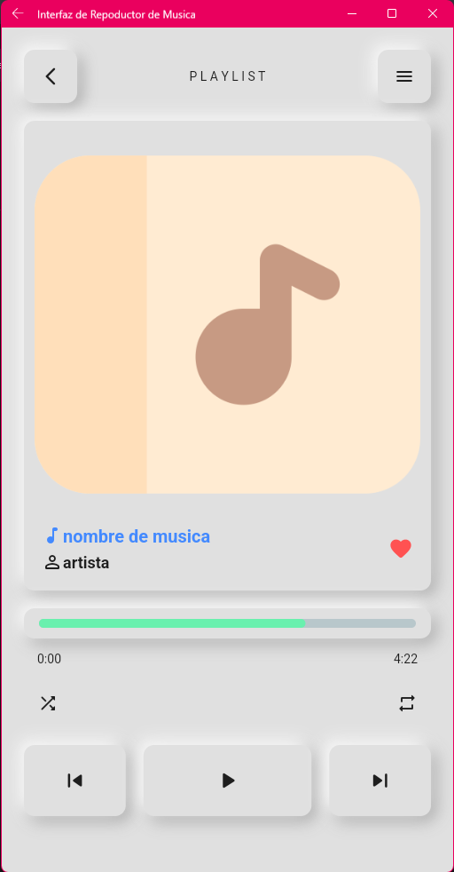

# Interfaz playlist de musica

Mi Segundo proyecto hecho con FLUTTER

## Aplicación de Interfaz grafica de como se veria un playlist hecho con flutter

Este proyecto es un punto de partida para una aplicación Flutter..

Algunos recursos para comenzar si este es su primer proyecto de Flutter:

- [Dart packages: para este proyecto utilice dart package](https://pub.dev/)
- [intro widgets: para este proyecto utilice widgets de flutter](https://docs.flutter.dev/ui/widgets-intro)

Para obtener ayuda para comenzar con el desarrollo de Flutter, consulte el
[documentación en línea](https://docs.flutter.dev/), que ofrece tutoriales,
muestras, orientación sobre desarrollo móvil y una referencia completa de la API.

  <h4>Version de la Aplicacion &nbsp;</h4>
   
  <h5>VERSION 1.0</h5>
  

<h3><b>Aplicacion Desarrollada por:</b> Fabrizio Barrios Saavedra (RFBS23 - fabridev)</h3>

